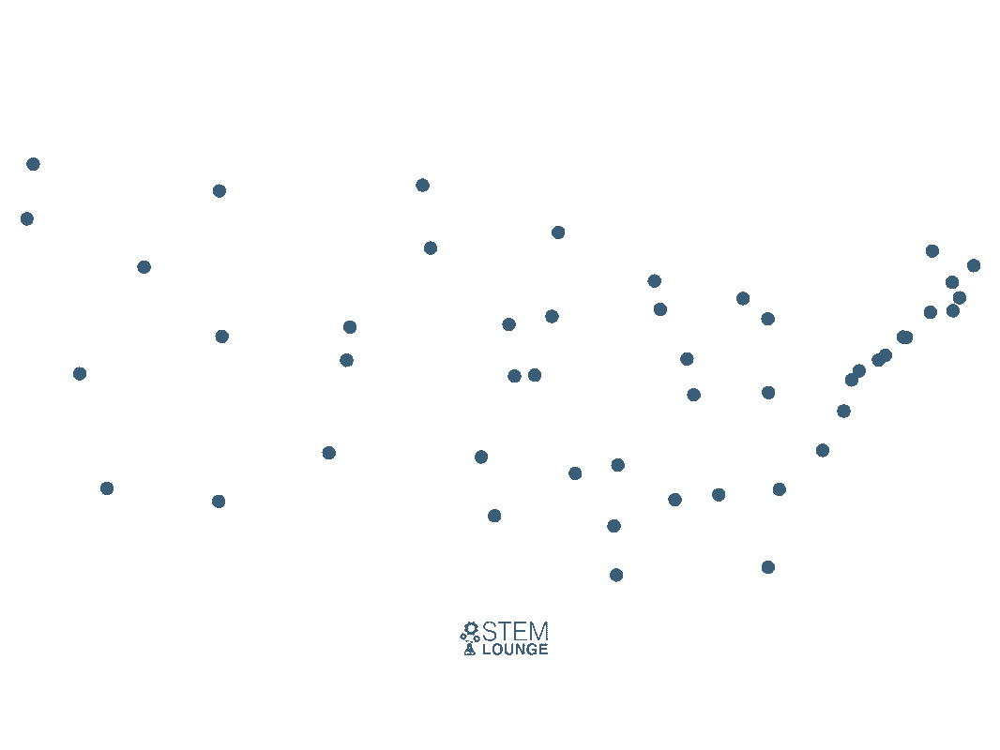

# Multiple Depot Vehicle Routing Problem (MDVRP) Solutions

## Introduction

This repository contains a comprehensive solution to the *Multiple Depot Vehicle Routing Problem* (MDVRP). The MDVRP is a complex variant of the Vehicle Routing Problem (aka. *Traveling Salesman Problem* \[TSP\]), where vehicles are dispatched from multiple depots to visit a set of nodes. This repository includes implementations of three key algorithms to address this problem:

1. **Nearest Neighbour**: This algorithm finds the nearest unvisited node from the current location until all nodes are visited. Below is a visualization of the alogorithm for a single depot variant, which is a classical TSP: 
2. **Nearest Insertion**: An enhancement over the Nearest Neighbour, this algorithm selects the nearest unvisited node and inserts them into the existing route at the position that minimizes the increase in travel distance. 
3. **Min Max Optimization**: Applied on an already defined routes, this algorithm aims to make the vehicle routes more uniform in terms of distance or load. It selects the longest route (Max cost) and tries to assign some of its nodes to shorter routes, thus Minimizing the Max route.

Additionally, a basic clustering algorithm is used to initially assign vertices to depots. *A node (vertice) is assigned to the closest depot it resides to*.

## Benchmarking Tests

To evaluate the effectiveness and efficiency of these algorithms, benchmarking tests were conducted:

1. **Nearest Neighbour vs. Nearest Insertion**: Comparison of these algorithms in terms of *solution quality (cost) and computational efficiency*.
2. **Efficacy of Min Max Algorithm**: Assessing the impact of the Min Max algorithm on pre-calculated routes, focusing on achieving uniformity in vehicle routes.

The solution cost is defined as the *total distance* of all the Vehicles to travel.

## Installation & Running

1. Clone the repository
2. `CD` into the repository
3. Install the requirements via `pip install -r requirements.txt`
4. Modify the parameters to your liking in the `/config/MDVRP_parameters.yaml`
5. Run the code via:
   - `python3 MDVRP_runner.py` to generate and solve a problem based on the parameters in the config file
   - `python3 benchmark_runner.py` to generate and run benchmarking tests (NOTE: the benchmarking part of the code needs refactor and is currently not working)

> [NOTE]
> The benchmark analysis tool needs complete rewriting and needs refactor.

## Resources

- Animations are from: [Animated Algorithms for the Traveling Salesman Problem](https://stemlounge.com/animated-algorithms-for-the-traveling-salesman-problem/)
